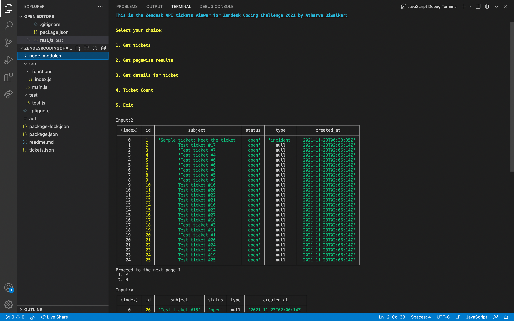

# Zendesk_Coding_Challenge_Atharva_Biwalkar_2021
This is the submission for the Zendesk Coding Challenge 2021 by Atharva Biwalkar.

This is a CLI based application, developed using Node.js that GETS the tickets from the Zendesk API,
and then parses it in the terminal.

Please follow the given steps in order to run the Project:

Install the required dependencies:
1) Express
2) Prompt
3) Mocha
4) Axios

Instructions to run the project:

1) Open the terminal on your system.
2) "npm install" will install all the required dependencies from the packages requirements.
3) Now run the main.js file with node. --> Usage "node ./src/main.js"

In order to run the tests:

Please follow the following instructions:
1) Open the terminal in your system.
2) "npm install" will install all the required dependencies from the packages requirements.
3) Use "npm run test" to run the required Unit Tests on the project.

**Authentication:**\
Please modify the URL, Username and Password fields in index.js and Main.js

**Criterias Satisfied:**

1) Successfully connect to the Zendesk API.
2) Requesting all the tickes for your account.
3) Displaying them in a list.
4) Displaying the individual ticket details.
5) Paging through the tickets when more than 25 tickets are returned from the API call.
6) All the basic errors are handled.
7) Unit Testing is included.
8) The CLI is very easy to use with basic knowledge and the tickets are displayed clearly in a tabulated manner.
9) Clean and consistent Code.

